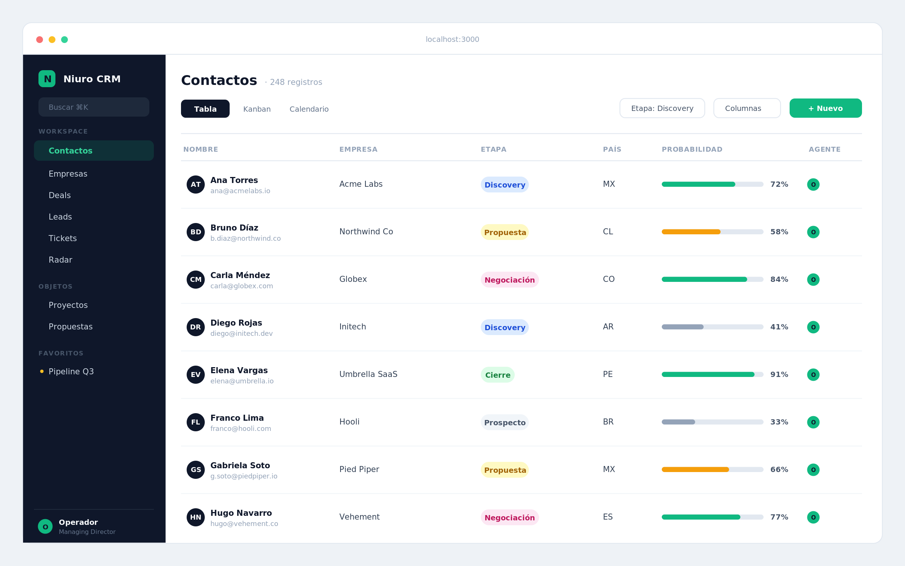

# Niuro CRM

Niuro CRM es un CRM local-first para un solo operador, con la UX y la paridad de funciones de Twenty. Corre entero en tu máquina sobre Next.js 16 + SQLite (better-sqlite3 + Drizzle), guarda los datos en un archivo local y suma IA a través de un subproceso del CLI oficial `claude` (sin API key). Sin servidores externos, sin cuentas: abrís `http://localhost:3000` y trabajás.



## Features

**Core CRM**
- Contactos, empresas, deals (oportunidades), leads y tickets.
- Vistas genéricas: tabla, kanban, calendario y panel de detalle, con filtros, orden y acciones en lote.
- Favoritos, edición inline, merge de registros e import/export CSV.

**Objetos y campos custom**
- Modelo de datos extensible (motor de metadatos tipo EAV): creás objetos y campos nuevos desde Ajustes > Modelo de datos, sin tocar código.
- Cada objeto custom hereda las mismas vistas (tabla/kanban/calendario/detalle) y CRUD genérico.

**Workflows**
- Motor in-process de triggers + acciones para automatizar tareas sobre tus registros.
- Acciones con IA opcionales dentro de un workflow.

**IA (copiloto y propuestas)**
- Copiloto y generación de propuestas vía subproceso del CLI `claude`.
- No usa API key: aprovecha tu sesión del CLI ya autenticada.

**WhatsApp**
- Inbox de WhatsApp opcional, alimentado por un bridge HTTP local.
- Sin el bridge, el inbox simplemente queda vacío (el resto del CRM funciona igual).

**Import / Export**
- Import/export CSV desde las vistas.
- Importación one-shot opcional desde HubSpot.
- Email digest diario opcional (vía Resend).

## Quick Start

Requisitos: **Node >= 24** y npm. (macOS recomendado; ver [Plataforma](#plataforma).)

```bash
npm install
npm run local   # build + init de la DB + start
```

Abrí `http://localhost:3000`. La base SQLite se crea sola en la primera corrida (`./data/crm.db`), no hay paso de migración manual. El primer arranque te pide crear tu **cuenta local** (email y contraseña, guardados solo en tu máquina) y después un onboarding corto (tu nombre, tu empresa, WhatsApp opcional).

Para desarrollo con hot-reload: `npm run dev`. Tests: `npm test`.

Guía detallada en [docs/SETUP.md](docs/SETUP.md).

## Integraciones (opcionales)

La app funciona sin ninguna configurada. Cada integración se activa por variables de entorno.

| Integración | Variables de entorno | Dependencia externa |
|---|---|---|
| IA (copiloto, propuestas, workflows con IA) | `CLAUDE_BIN` (opcional, override del binario) | CLI `claude` instalado y autenticado |
| WhatsApp inbox | `WHATSAPP_BRIDGE_URL`, `WHATSAPP_DB_PATH`, `WHATSAPP_SINCE` | Bridge HTTP de WhatsApp en `localhost:8080` |
| Email digest diario | `RESEND_API_KEY`, `DIGEST_EMAIL`, `DIGEST_FROM` | Cuenta de Resend |
| Import HubSpot (one-shot) | `HUBSPOT_API_KEY` | Cuenta de HubSpot |

Detalle de cada una en [docs/INTEGRATIONS.md](docs/INTEGRATIONS.md). Lista completa de variables en `.env.example`.

> Importante: **no** configures `ANTHROPIC_API_KEY`. Interfiere con la autenticación del CLI `claude` que usa la IA.

## Datos, cuenta y cifrado

- **Tus datos**: un único archivo SQLite local (`./data/crm.db`). Backup WAL-safe con `npm run backup` (ver [docs/BACKUP.md](docs/BACKUP.md)).
- **Cuenta local**: una sola cuenta por instalación (email + contraseña, hash scrypt en tu DB). Sin servidor externo. Si la olvidás: `npx tsx scripts/reset-account.ts` (resetea credenciales, no borra datos).
- **Cifrado en reposo (opcional)**: si hay una llave disponible, la DB se cifra sola en el próximo arranque (SQLCipher vía `better-sqlite3-multiple-ciphers`). La app de Mac genera y guarda la llave en el Keychain automáticamente. Corriendo por npm se activa con la variable `CRM_DB_KEY`, o creando la entrada del Keychain de macOS: `security add-generic-password -s io.niuro.crm -a db-key -w "tu-llave-larga"`. Sin llave, la DB queda en texto plano (default en dev, Linux y CI). Ojo: si perdés la llave, los datos cifrados no se recuperan.

## Plataforma

macOS-first. El core de la app corre bien en **Linux**. **Windows** está sin probar. El deploy de producción always-on usa launchd (`com.niuro.autocrm`, puerto 3001), que es solo macOS; para uso normal alcanza con `npm run local` y no necesitás launchd.

## Arquitectura

Next.js App Router (páginas + route handlers en `/api/*`), un motor genérico de vistas de registro configurado por objeto, un sistema de objetos/campos custom basado en metadatos (EAV), un motor de workflows in-process, IA por subproceso del CLI, y SQLite con Drizzle (schema y seeds en `src/db/index.ts`). El detalle técnico para contribuir está en [docs/ARCHITECTURE.md](docs/ARCHITECTURE.md).

## App de Mac (Tauri)

Podés correr el CRM como app nativa de macOS (`.app` + `.dmg`). El scaffolding está
incluido (`src-tauri/`): la app levanta el server Next embebido en localhost y lo abre
en una ventana nativa. Requiere Node 24+, Rust y Xcode Command Line Tools.

```bash
npm install
npm run desktop:build   # genera src-tauri/target/release/bundle/
```

Guía completa en [docs/DESKTOP.md](docs/DESKTOP.md).

## Roadmap

- Desktop v2: bundlear Node (app autocontenida), firma + notarización, auto-update.

## Contribuir

Ver [CONTRIBUTING.md](CONTRIBUTING.md). Si usás Claude Code u otro agente sobre el repo, leé también [CLAUDE.md](CLAUDE.md).

## Licencia

[AGPL-3.0](LICENSE).
